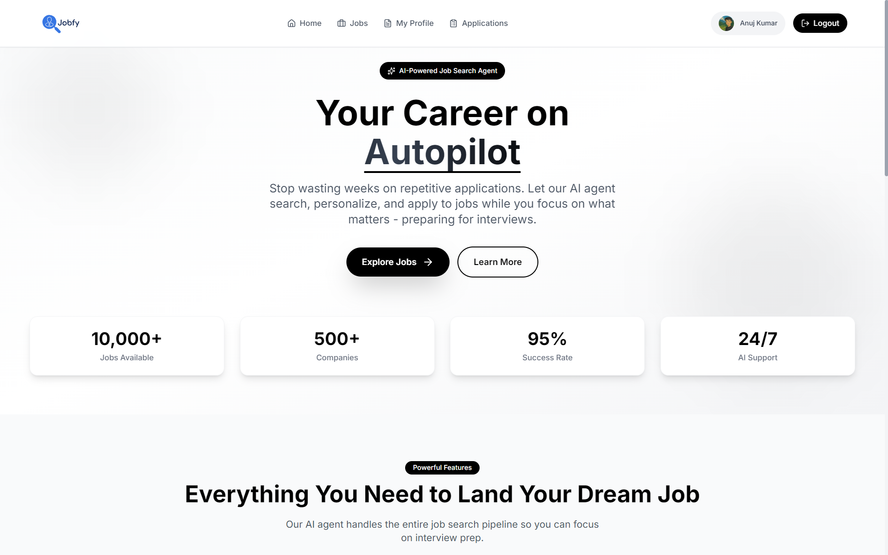
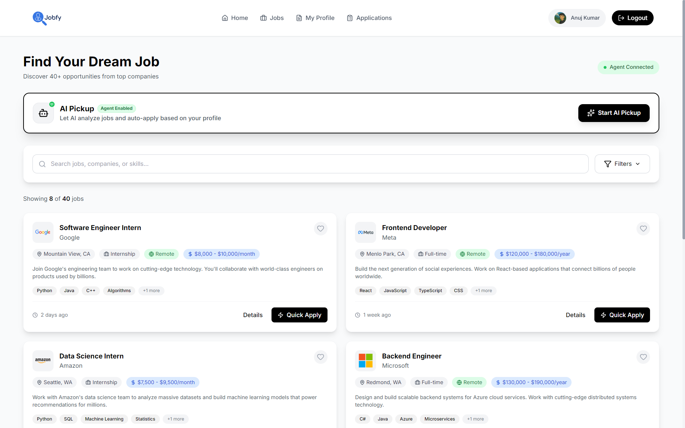
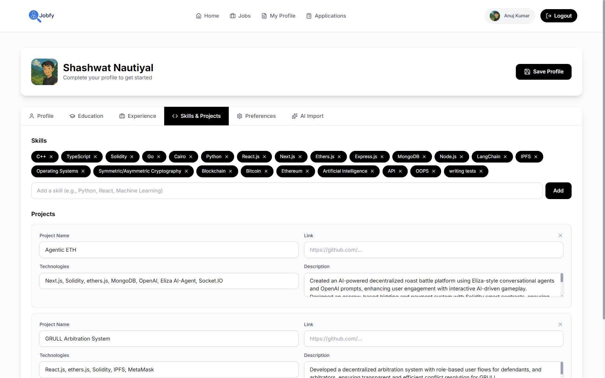
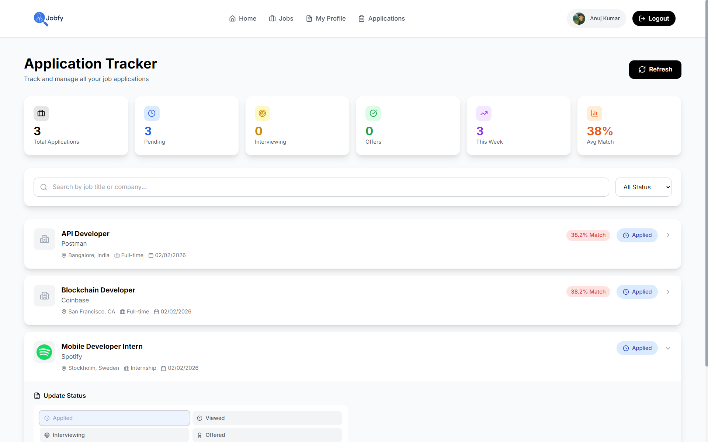

# JobFy: AI-Powered Smart Career Platform

JobFy is a modern, AI-integrated job search and application management platform designed to streamline the career journey. By leveraging advanced Large Language Models (LLMs) and a sleek, responsive interface, JobFy transforms how candidates find and apply for opportunities.

**🔗 [Live Demo](https://job-fy.vercel.app/)**



## 🚀 Key Features

### 🤖 AI-Driven Core
- **Resume-to-Profile Extraction**: Upload a PDF or paste text, and use **Google Gemini AI** to automatically extract skills, experience, education, and projects into a structured profile.
- **Smart Job Ranking**: Every job is analyzed against your profile using a specialized **AI Agent** (FastAPI backend) to provide a match percentage and detailed explanation of why it fits (or where the gaps are).
- **Automated Application Queue**: Let the AI Agent handle the application process for you. Rank jobs, add them to your queue, and apply automatically with optimized payloads.

### 💼 Career Hub
- **Unified Job Board**: Access job listings from multiple sources, including a dedicated portal backend and real-time agent-aggregated data.
- **Comprehensive Profile Builder**: A multi-tab, intuitive profile management system covering everything from personal branding to detailed project proofs.
- **Application Tracking**: Monitor your application status, maintain history, and view AI-generated insights for every job you've applied to.

### 🎨 Premium User Experience
- **Modern UI/UX**: Built with a "premium first" philosophy using Tailwind CSS, featuring glassmorphism, smooth transitions, and a clean aesthetic.
- **Responsive Design**: Optimized for everything from large desktops to mobile devices.
- **Dark/Light Mode Ready**: Clean, professional color palette optimized for long browsing sessions.

## 📸 Screenshots

| Landing Page | Job Search |
| :---: | :---: |
|  |  |

| Profile Management | AI Insights |
| :---: | :---: |
|  |  |

## 🛠️ Tech Stack

### Frontend
- **Framework**: [React 19](https://react.dev/) + [Vite](https://vitejs.dev/)
- **Styling**: [Tailwind CSS](https://tailwindcss.com/)
- **State & Auth**: [Firebase](https://firebase.google.com/) (Authentication & Firestore)
- **Icons**: [Lucide React](https://lucide.dev/)
- **PDF Processing**: [PDF.js](https://mozilla.github.io/pdf.js/)
- **AI Integration**: [Google Gemini API](https://ai.google.dev/) (Client-side parsing)

### Backend (AI Agent)
- **Framework**: [FastAPI](https://fastapi.tiangolo.com/) (Python)
- **AI Engine**: [Together AI](https://www.together.ai/) & Custom Ranking Agents
- **Hosting**: Hugging Face Spaces (Portal) / Local (Agent API)
- **Data Fetching**: JSearch (RapidAPI)

## 📦 Project Structure

```text
JobFy/
├── src/
│   ├── components/     # Reusable UI components
│   ├── config/         # Firebase and other service configs
│   ├── context/        # Auth and Global State
│   ├── pages/          # Main application views (Landing, Jobs, Profile, etc.)
│   ├── services/       # API integration layers (Agent & Portal)
│   └── assets/         # Styles and static assets
├── job_search/         # Python FastAPI Backend (Agent API)
│   ├── agents/         # AI Tooling and LLM logic
│   └── data/           # Local storage for agent operations
└── public/             # Static files
```

## 🚀 Getting Started

### Prerequisites
- Node.js (v18+)
- Python (3.9+)
- Firebase Account
- Google Gemini API Key
- Together AI API Key (for backend)

### Installation

1. **Clone the repository**
   ```bash
   git clone https://github.com/Anuj-kumar-in/JobFy.git
   cd JobFy
   ```

2. **Frontend Setup**
   ```bash
   npm install
   # Create a .env file based on .env.example
   npm run dev
   ```

3. **Backend Setup (Agent API)**
   ```bash
   cd job_search
   pip install -r requirements.txt
   # Set environment variables (TOGETHER_API_KEY, PORTAL_API)
   python agent_api.py
   ```

## 📄 Environment Variables

Create a `.env` file in the root directory:

```env
VITE_FIREBASE_API_KEY=your_key
VITE_FIREBASE_AUTH_DOMAIN=your_domain
VITE_FIREBASE_PROJECT_ID=your_id
VITE_FIREBASE_STORAGE_BUCKET=your_bucket
VITE_FIREBASE_MESSAGING_SENDER_ID=your_id
VITE_FIREBASE_APP_ID=your_id

VITE_GEMINI_API_KEY=your_gemini_key
VITE_JOB_PORTAL_API=https://krishnasimha-portal-backend.hf.space
VITE_JOB_AGENT_API=http://localhost:8000
```


Built with ❤️ by the Cyborgs Team
